# CyberShield Academy — Plataforma de Formación en Ciberseguridad

Este es mi proyecto un sitio web de presentación para la academia especializada en Hacking Ético, Red Team, Blue Team y Hardware Hacking (Flipper Zero, ESP32, HackRF One). 

- **Desplegue de la app en vercel** [https://cyber-shield-indol.vercel.app/](https://cyber-shield-indol.vercel.app/)
- **Repositorio en GitHub:** [https://github.com/David2421b/CyberShield.git](https://github.com/David2421b/CyberShield.git)

---

## Descripción del Proyecto
La aplicacion es una tienda virtual que resuelve la falta de plataformas de aprendizaje orientadas a la ciberseguridad a nivel de sofware, fisico o señales, esta está enfocada en las personas que quieren aprender mas sobre la seguridad informatica, la plataforma le permite al usuario explorar el catalogo de cursos que hay disponibles para aprender e inscribirse en el que desee participar

---

## Decisiones Técnicas

### 1. CSS: Flexbox vs. Grid
- **CSS Grid:** Lo utilicé en la sección del catálogo (`.courses-grid`) y en la sección de características (`.features-grid`). Grid fue la mejor elección aquí porque permite organizar las tarjetas en cuadrículas que se adaptan automáticamente al ancho de la pantalla (`repeat(auto-fit, minmax(300px, 1fr))`) sin necesidad de romper la maquetación.

- **Flexbox:** Lo utilicé en el `<header>` (`.header-container`), en las tarjetas individuales y en el `<footer>`. Flexbox es óptimo para alineaciones unidimensionales o sea para distribuir el logo a la izquierda y el menú a la derecha y para organizar verticalmente el contenido dentro de cada tarjeta de curso.

### 2. Funcionamiento de JavaScript
#### Dividi el JavaScript en 3 archivos: `js/main.js`, `js/cursos_data.js`, `js/validacion.js`

- **DOM & Catálogo Dinámico:** Esta en `js/main.js` obtengo el arreglo de objetos de cursos de `js/cursos_data.js` para renderizar las tarjetas dinámicamente.
- **Filtro de Categorías:** Escucho los eventos `click` en los botones del filtro para ejecutar `.filter()` sobre el arreglo de cursos y re-renderizar solo la categoría seleccionada (Red Team, Blue Team, DFIR).
- **Validación del Formulario:** En `js/validacion.js` intercepto el evento `submit` con `preventDefault()`. Valido los campos obligatorios, el formato de correo mediante expresiones regulares (`Regex`) y la longitud mínima del mensaje. Los errores se inyectan dinámicamente manipulando clases `.error` y mostrando etiquetas `` bajo cada input sin recargar la página ni usar `alert()`.

### 3. Uso de Inteligencia Artificial
Utilice la IA, para generar ideas como paletas de colores, cursos y nombres, tambien para corregir errores de interconeccion de archivos, ordenar las fotos en el ` README.md `, ademas aproveche la IA para usar N8N y enviar correos reales al usuario (Valido por 14 dias ya que es la capa gratuita), por ultimo use la IA para generar una licencia donde diga que mi proyecto no lo puede usar nadie mas debido a que el Repositorio estara publico en mi GitHub.
#### Pruebas de uso de IA

  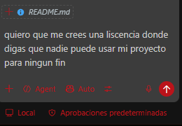

  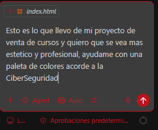

  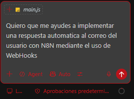

  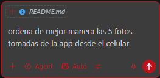

### 4. Retos y Soluciones
Mi mayor reto fue coordinar la actualización de errores en el formulario en tiempo real (eventos `input`) con la auto-selección de cursos desde las tarjetas del catálogo. Lo resolví usando funciones *helper* especializadas (`setError` y `clearError`) que aíslan la lógica del DOM para mantener el código mantenible. Tambien tuve problemas al aprender a usar los WebHocks de N8N para poder agregar a un payload la info que deberia poder enviar la app al usuario

---
### Capturas de la App
#### PC

  <video src="assets/app_photos/app_completa.mp4" width="500" controls></video>

  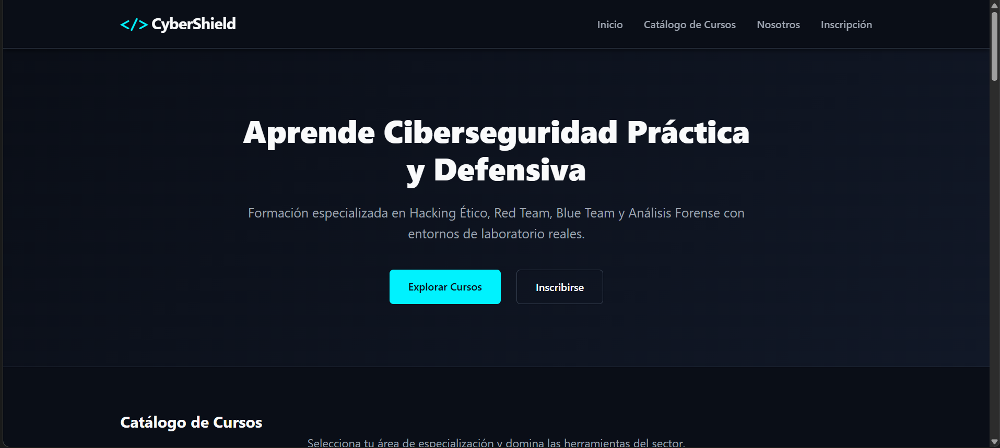

  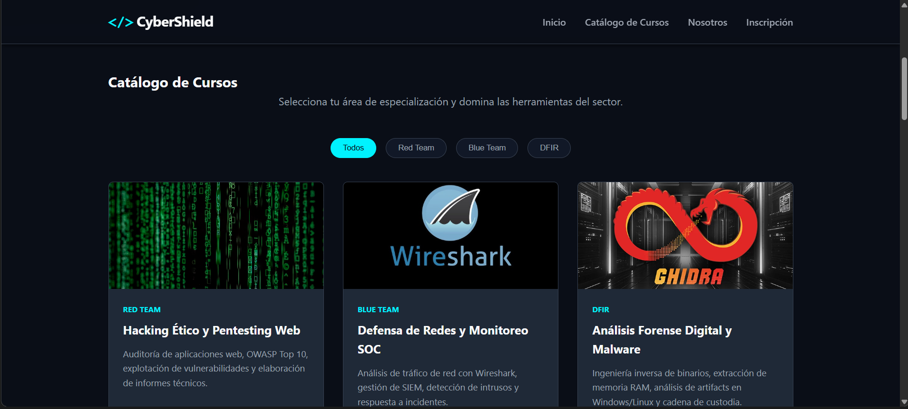

  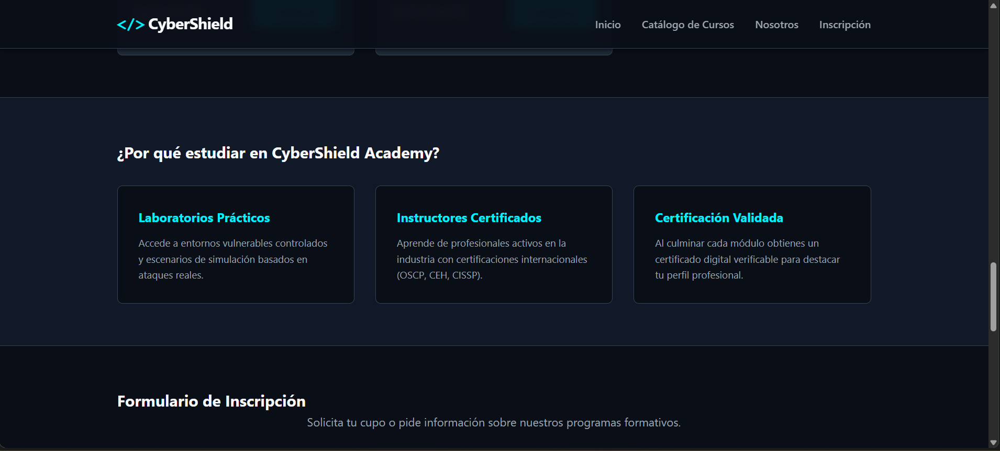

  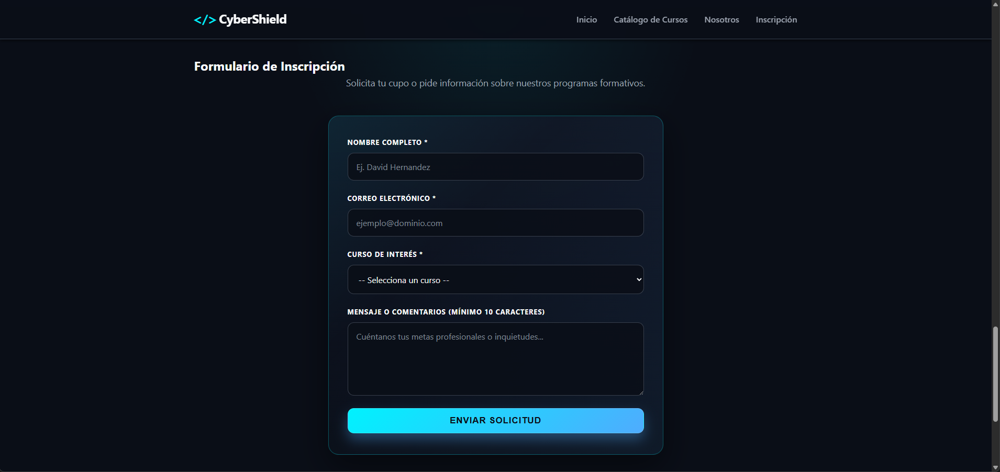

#### Celular

  <table>
    <tr>
      <td align="center">
        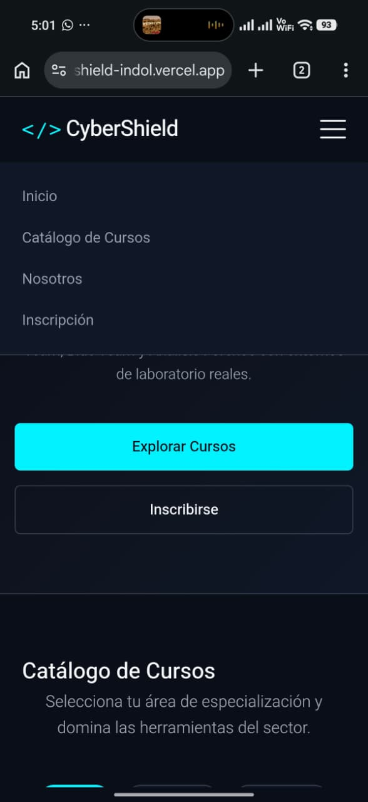
      </td>
      <td align="center">
        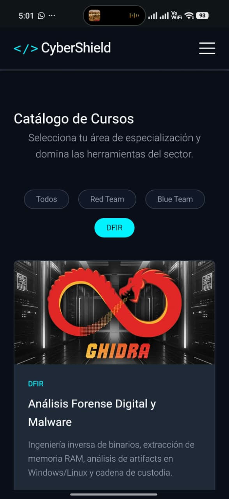
      </td>
      <td align="center">
        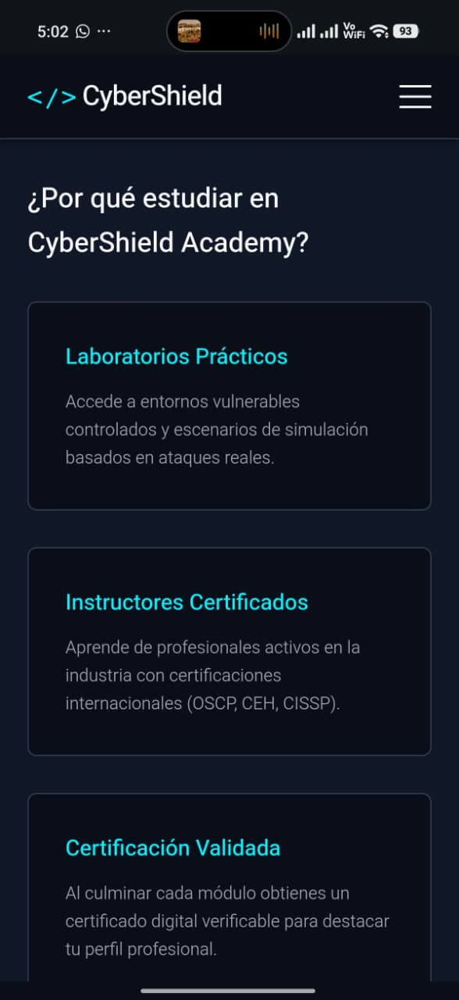
      </td>
    </tr>
    <tr>
      <td align="center">
        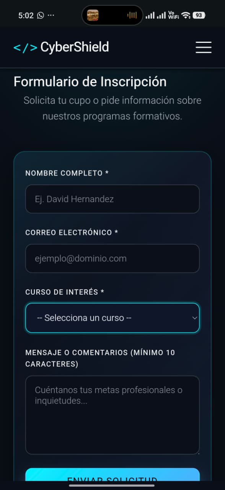
      </td>
      <td align="center">
        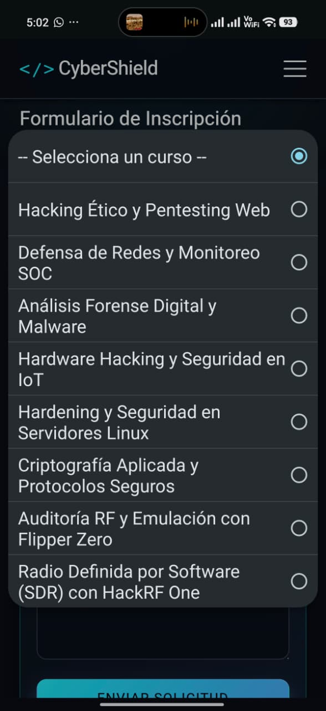
      </td>
      <td align="center">
        
      </td>
    </tr>
  </table>

